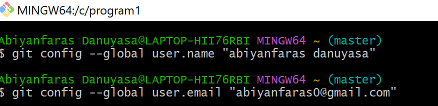
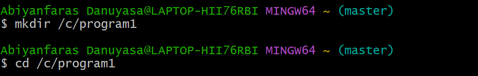
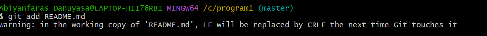
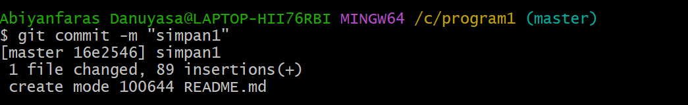
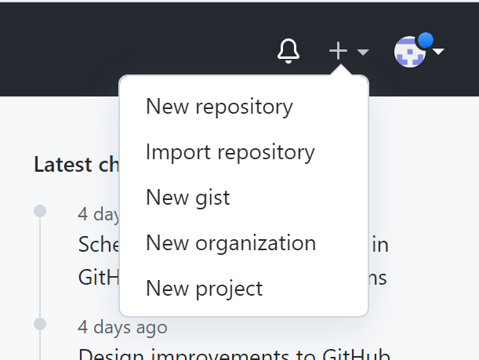
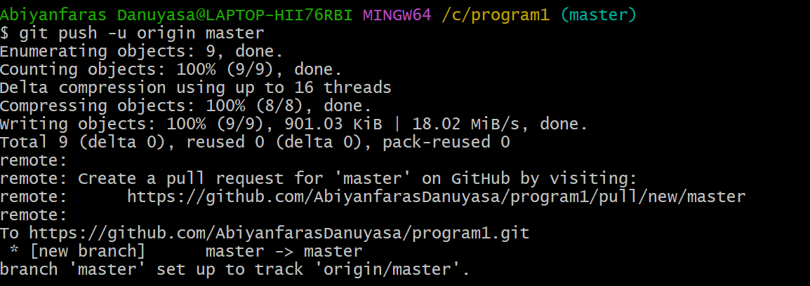
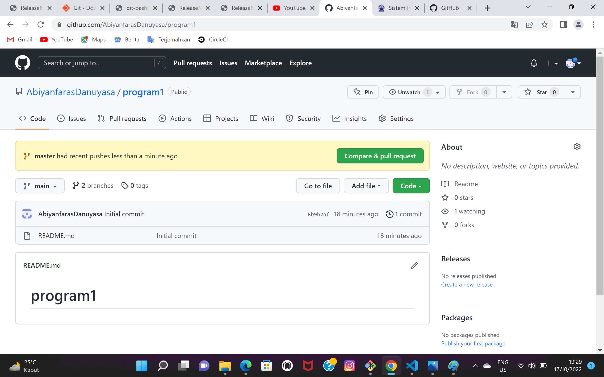

## program1 

# Tugas Bahasa Pemograman

## Download GIT
membuka website resmi git (git-scm.com), lalu diinstal sesuai laptop yang di gunakan
[gambar1](gambar/faras1.png)

## membuka GIT bash
setelah itu membuka git bash
[gambar2](gambar/faras2.png)

## membuat global config
pada saat pertama kali menggunakan git, kita perlu melakukan konfigurasi user.name dan user.email., konfigurasi ini bisa dilakukan untuk global repository atau induvidual repository. bila belum di lakukan konfigurasi, akan mengakibatkan terjadinya kegagalan saat menjalankan perintah git commit
config Global Repository 
```
$ git config --global user.name "nama_user"
$ git config --global user.email "nama_email"
```


## membuat repository local
buka direktory aktif, misal: c:\program1(buka menggunakan windows explorer). klik kanan pada direktory aktif, dam pilih menu GIT BASH, sehingga muncul git bash commad
```
$ mkdir program1
$ cd program1
```
 sehingga terbentuk satu direktory baru dibawahnya, selanjutnya masuk kedalam direktory tersebut dengan perintah cd (change directory)
 

 ## Membuat Repository local
 jalankan perintah git init, untuk membuat repository local.
 ```
 $ git init
 ```
 Repository baru berhasil di instalisasi , dengan terbentuknya suat hidden dengan nama. git pada direktory tersebut, semua perubahan pada working directory akan disimpan
 

 ## Menambahkan File baru pada Repository
 untuk membuat file dapat menggunakan text editor, lalu menyimpan filenya pada direktory aktif(repository)
 ```
 $ echo "#program1" >> README.md
 ```
 

 umtuk menambahkan file yang baru saja dibuat gunakan perintah git add
 ```
 $ git add README.md
 ```
 

 ## Menyimpan Perubahan ke database(commit)
 umtuk menyiapkan perubahan yang ada kedalam database repository loacl, gunakan perintah
 ```
 $ git commit -m "simpan1"
 ```
 

## Membuat Repository Server
Server Repository yang digunakan http://github.com anda harus membuat akun terlebih dahulu pada github, klik tombol start a project, atau dari menu (icon+) klik new repository

## Membuat Repository Server
isi nama repositorynya, misal:Program1. lalu klik tombol create repository


## Menambahkan Remote Repository
Repository merupakan server yang digunakan umtuk menyiapkan perubahan pada local repository sehingga dapat diakses oleh banyak user, untuk menambahkan remote remote repository server, gunakan perintah
```
$ git remote add origin https://github.com/abuazzam/labby1.git
```


## Mengirim Perubahan ke server (push)
untuk mengirim perubahan pada local repository ke server gunakan perintah git pus
```
$ git pus -u origin master
```
lalu perintah akan meminta memasukan username dan pada akun github.com


## Melihat hasilnya pada server Repository
buka halaman github.com arahkan pada repository. maka perubahan akan terlihat pada laman tersebut


## Clone Repository
clone repoasitory adalah meng-copy repository server dan secara otomatis membuat suatu direktory sesuai dengan nama repositorynya (working directory). untuk melakukan cloning, menggunakan perintah 
```
git clone [url]
```
![gambar13]